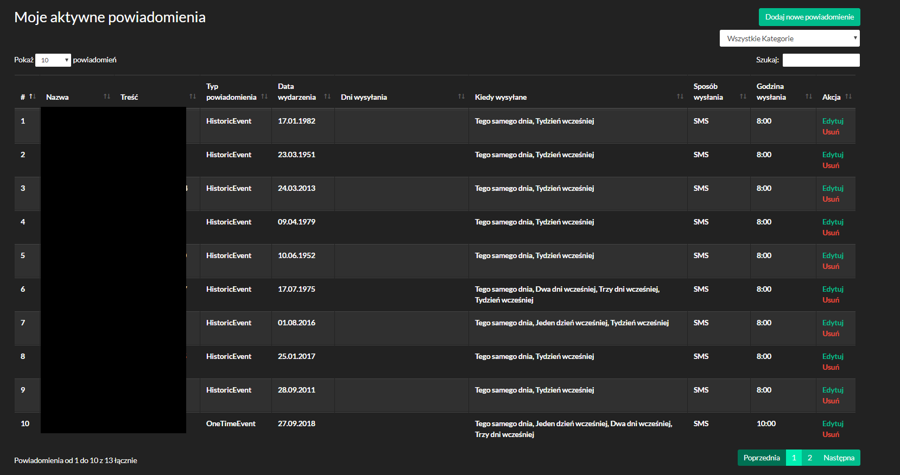
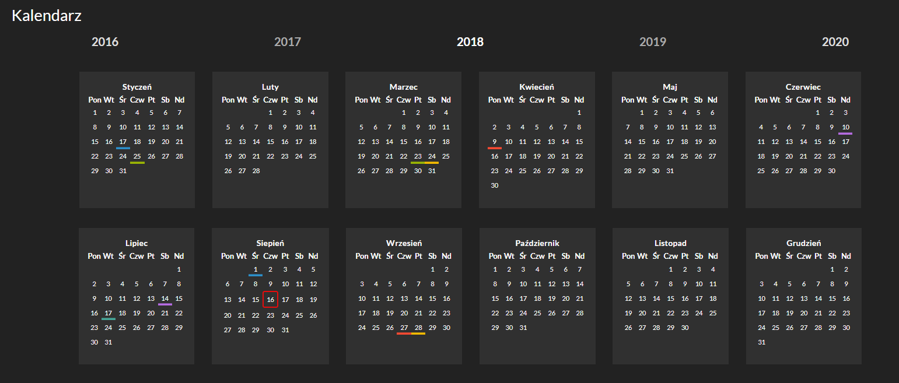
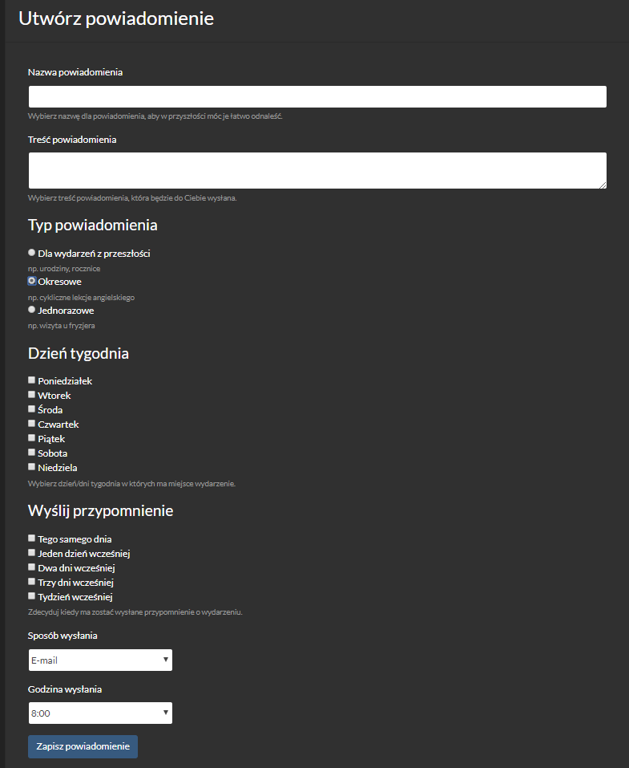
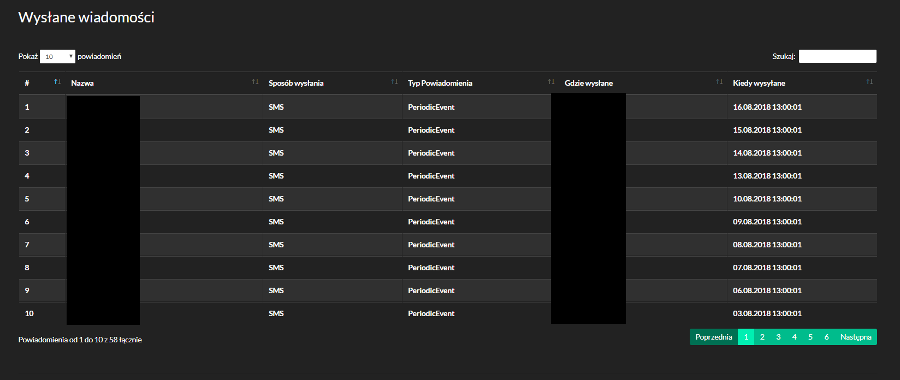

# EventsReminder

Events reminder is quite easy web based application, which allows to set reminders about events. 

Online demo is available here: https://eventsreminder2.azurewebsites.net

 Some screenshots from application:
 

